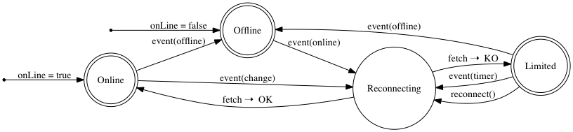

# ember-network-state

[](https://travis-ci.org/BBVAEngineering/ember-network-state)
[](https://badge.fury.io/gh/BBVAEngineering%2Fember-network-state)
[](https://badge.fury.io/js/ember-network-state)
[](https://david-dm.org/BBVAEngineering/ember-network-state)
[](https://codecov.io/gh/BBVAEngineering/ember-network-state)
[](https://greenkeeper.io/)

## Information

[](https://nodei.co/npm/ember-network-state/)

Check and react network state of your progressive web app.

The browser provides network property `window.navigator.onLine` and events `online` and `offline`. The problem is that this API is not reliable, we can have an interface connection (phone is not on airplane mode, we have WiFi data) but the network may not have access to the internet.

In order to confirm the connection status, this addon pings a URL (by default it is the `favicon.ico`) when it detects that user supposedly have connectivity again. When the ping ends and it goes OK, it will switch to `online` state, but if ping doesn't go OK, this addon will keep the state `limited` and it will schedule a ping every certain time.

If the browser has implemented [connection API](http://wicg.github.io/netinfo/), it will listen for changes on network quality as well.

Below is an example of all states of the service:



## Usage

Install the addon with ember-cli.

```javascript
ember install ember-network-state
```

Inject the service in your app:

```javascript
export default Component.extend({
  network: inject()
});
```

### Interface

#### Properties

- `state`: returns current state of the network. Possible values: `ONLINE`, `OFFLINE` and `LIMITED`. You can import values from:
  `import { STATES } from 'ember-network-state/constants';`

- `remaining`: returns remaining milliseconds to next reconnect.

- `isOnline`: computed value from `state` that returns when is `ONLINE`.

- `isOffline`: computed value from `state` that returns when is `OFFLINE`.

- `isLimited`: computed value from `state` that returns when is `LIMITED`.

- `isReconnecting`: checks when service is testing for connection.

- `hasTimer`: checks when service has scheduled a timer.

- `lastReconnectDuration`: saves last reconnect duration.

- `lastReconnectStatus`: saves last reconnect status.

#### Methods

- `reconnect`: you can call this method to force a reconnect request. Next delay will be multiplied as if it will reach countdown to zero.

#### Events

You can subscribe to the `change` event to receive changes on `state` property.

```javascript
const network = this.get('network');

network.on('change', (state) => {});
```

### Configuration

The addon can be configured in `config/environment.js` of your app.

```javascript
module.exports = function(/* environment */) {
  return {
    'network-state': {
      reconnect: {
        auto: true,
        path: '/favicon.ico',
        delay: 5000,
        multiplier: 1.5,
        timeout: 30000,
        maxDelay: 60000,
        maxTimes: -1
      }
    }
  };
};
```

Posible values:

- `reconnect`: Object to configure reconnect parameters.
  - `auto`: Auto reconnects when network changes.
  - `path`: Path to request on reconnect. Default: `/favicon.ico`.
  - `delay`: Initial delay for retry a reconnection. Default: `5000`.
  - `multiplier`: Increment for next retry. Next delay will be `delay * multiplier`. Default: `1.5`.
  - `timeout`: Reconnect request timeout.
  - `maxDelay`: Maximum delay for a reconnect. Default: `60000`.
  - `maxTimes`: Maximum times for a reconnect. When value is negative, its `Infinity`. Default: `-1`.

## Contribute

If you want to contribute to this addon, please read the [CONTRIBUTING.md](CONTRIBUTING.md).

## Versioning

We use [SemVer](http://semver.org/) for versioning. For the versions available, see the [tags on this repository](https://github.com/BBVAEngineering/ember-network-state/tags).

## Authors

See the list of [contributors](https://github.com/BBVAEngineering/ember-network-state/graphs/contributors) who participated in this project.

## License

This project is licensed under the MIT License - see the [LICENSE.md](LICENSE.md) file for details
